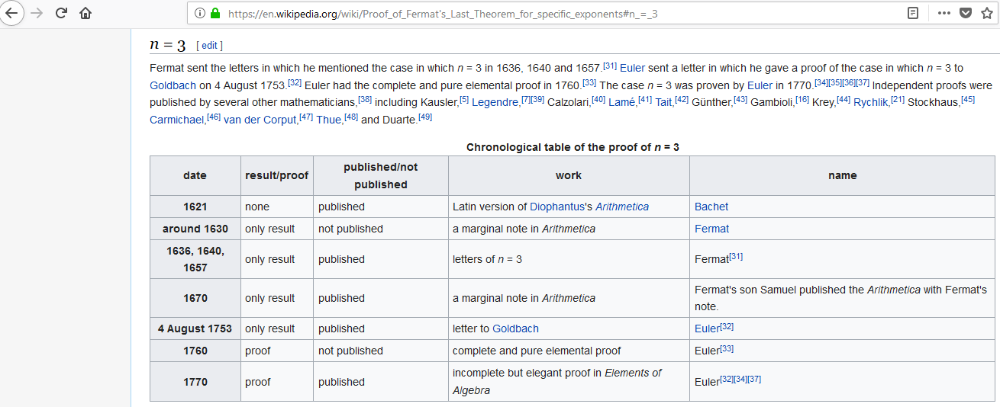
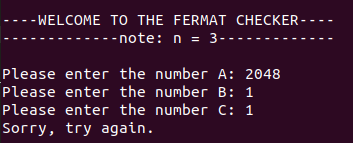

# Andrew Wiles (Other, 250 points)

Co-written with Ezra Edelman.

We're given no source and a netcat link, and we're told that Keith disproved Fermat's Last Theorem for n = 3. After doing some research, we find that Fermat's Last Theorem states that

```
a^n + b^n ≠ c^n
```

In this case, for n = 3, we're trying to prove that the sum of two cubed numbers (greater than the trivial case of 0) will never equal a third cubed number. Since Keith disproved this, has it been proved before?



Whoops. Since a proof has existed for almost 400 years, there **must be something wrong with Keith's implementation**.

Either Keith has encountered a *floating point precision error*, as [demonstrated on the Simpsons](https://www.npr.org/sections/krulwich/2014/05/08/310818693/did-homer-simpson-actually-solve-fermat-s-last-theorem-take-a-look), or we have an *overflow error*. Testing out Homer's input didn't work, so let's operate under the assumption that we're dealing with an overflow for now. 

Recall how signed integers work: Say you have an `int`. Typically, ints have 32 bits of space, and can hold any value from -2^31 + 1 to 2^31 - 1. So what happens at 2^31? 

At 2^31 - 1, an int looks like `0x 7fff ffff`. When this rolls over and reaches `0x8000 0000`, the "sign bit" is now active, and this value is now -2^31 + 1. What would happen if we put in 2^32?

2^32 = 2 * 2^31, so we'd essentially be inputting 2^31 twice. The first time, we rollover from 2^31 - 1 to -2^31 + 1. The second time, *we rollover back to 0*.

We know that n = 3 in this case, so we have to find a number that, when cubed, rolls over and overflows to 0, because 0^3 + number^3 = number^3, "disproving" Fermat's Last Theorem.

Using the same trick as above, we can construct a number 2^33, which is equal to (2^11) ^ 3. The important thing to note here is that 2^33 = 2^32 (overflow) * 2, so 2^33 would overflow to 0 the same way 2^22 would. In fact, *any power of 2 > 33 would overflow to 0, as the overflow is completed an even number of times every time*.

Let's try it out.



Worth a shot. What if the data type is bigger, say a `long`? Longs hold 64 bits of data, so it will overflow to 0 when an input of 2^64 or higher is sent. The closest, greater multiple of 3 is 66, so let's try inputting 2^22 = 4194304. This will equal 2^2 * 2^64 (overflow to 0), which should equal 0 when input.


#### Flag: `flag{contained_in_margins}`

------

**Epilogue:** Here's proof that a higher power of two, like (2^23)^3 will still overflow to 0.

