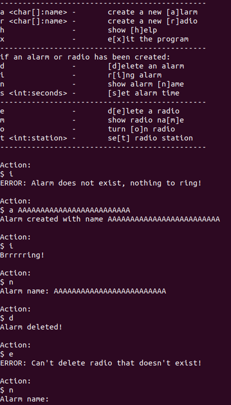
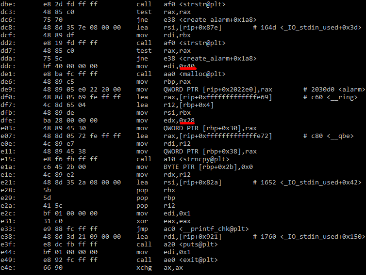
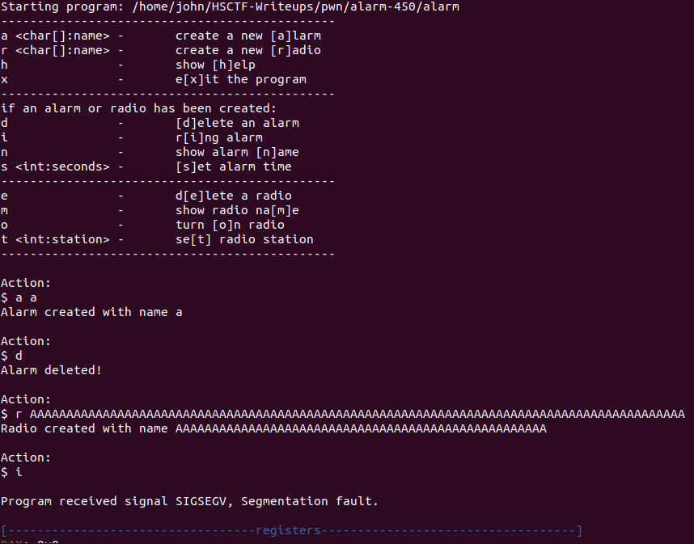
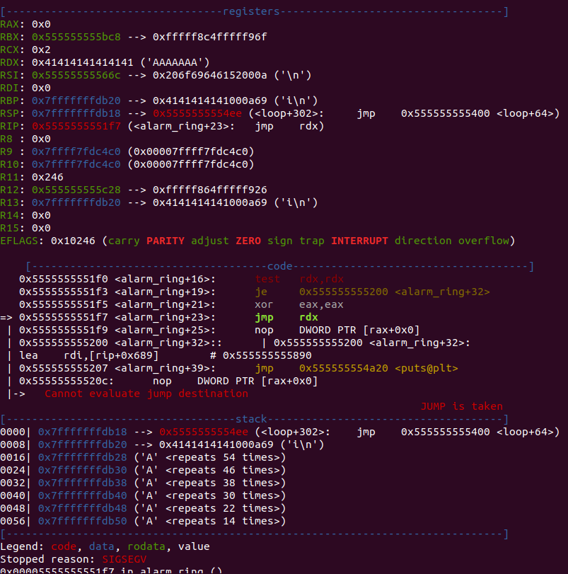
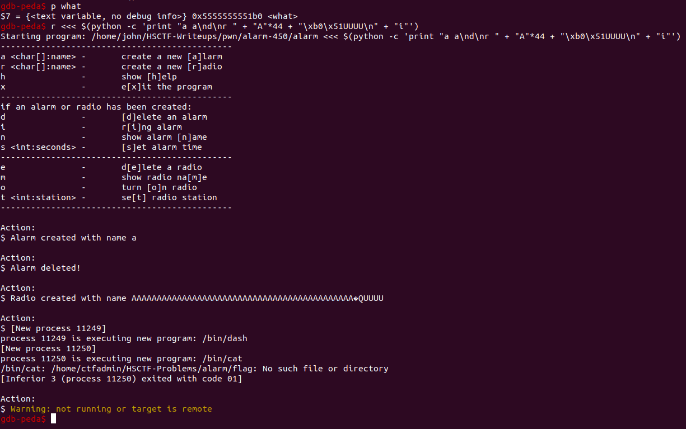
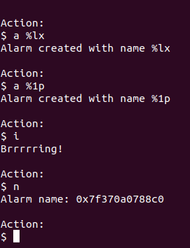
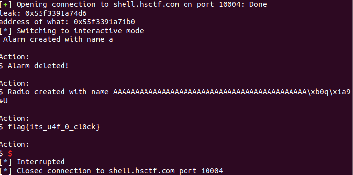
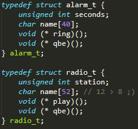

# Alarm (Binary Exploitation, 400 points)

We are given a binary and no source code this time! Let's try running it and testing some inputs, much like we did for [Review](../review-100/README.md).

\


Hmm...that "Alarm name: " looks rather suspicious at the bottom. As well, this program checks for format string attacks. Let's examine the objdump.

Right away, we identify `00000000000011b0 <what>:` as our probable flag function. Also, we find that this binary was **compiled with ASLR / PIE**. Our previous binaries, like Caesar, Review, etc. all had function addresses beginning with 0x0804 and a fixed code location. Now, this strange code location signifies that our code has **ASLR, PIE, or both, randomizing libc locations and/or code locations**. We can see that function addresses instead look like `0x11b0`, signifying an *offset* froma randomized base, not absolute location.We'll set that aside for now. 

Let's look at something we can control, like create_alarm().



We notice a whole bunch of strstr() at the beginning; this must be what checks for strings like "%x" and ends the program prematurely. As well, **we notice a malloc() call** of size 0x40. After that, it appears that some...pointers? named \_\_ring and \_\_qbe are allocated, as well as an array of size 0x28, or 40. Something is strncpy()'d in (presumably the name), and then the method ends.

Let's compare this to create_radio().


Interesting! The name array is now 0x34, a whole 12 characters larger. As well, the malloc() call allocated 0x48 bytes of memory. Hmmmm...

Recall that malloc fastbin lists are split into lists of size 0x8. Assuming that an alarm and radio get placed into the same bin, we may be able to overwrite something with the longer name buffer. Since we saw the "Alarm name:" earlier, there is a high chance of a **use-after-free exploit**. Since \_\_qbe seems to stay unused, we may be able to overwrite \_\_ring . Let's test it out!


Success! Let's hop into GDB and figure out what's going on. Note that I have [PEDA](https://github.com/longld/peda) installed; optional, but helpful.





Let's narrow that down a bit. Through trial and error of various inputs, we find that a name of size 44 allows us to overflow RDX with whatever code we want. From here, we can jump to what().



We've overcome the first obstacle and have control of EIP! Remember though, this code will **move around** due to ASLR / PIE. Let's try running `set disable-randomization off` so GDB doesn't "helpfully" disable ASLR for us.

```
gdb-peda$ p what
$3 = {<text variable, no debug info>} 0x55ebb16661b0 <what>
gdb-peda$ disas main
Dump of assembler code for function main:
   0x000055ebb1665b10 <+0>:	sub    rsp,0x8
   0x000055ebb1665b14 <+4>:	mov    rdi,QWORD PTR [rip+0x202595]        # 0x55ebb18680b0 <stdout@@GLIBC_2.2.5>
   0x000055ebb1665b1b <+11>:	xor    esi,esi
   0x000055ebb1665b1d <+13>:	call   0x55ebb1665a50 <setbuf@plt>
   0x000055ebb1665b22 <+18>:	xor    eax,eax
   0x000055ebb1665b24 <+20>:	call   0x55ebb16663c0 <loop>
End of assembler dump.

...

gdb-peda$ p what
$4 = {<text variable, no debug info>} 0x55843c8981b0 <what>
gdb-peda$ disas main
Dump of assembler code for function main:
   0x000055843c897b10 <+0>:	sub    rsp,0x8
   0x000055843c897b14 <+4>:	mov    rdi,QWORD PTR [rip+0x202595]        # 0x55843ca9a0b0 <stdout@@GLIBC_2.2.5>
   0x000055843c897b1b <+11>:	xor    esi,esi
   0x000055843c897b1d <+13>:	call   0x55843c897a50 <setbuf@plt>
   0x000055843c897b22 <+18>:	xor    eax,eax
   0x000055843c897b24 <+20>:	call   0x55843c8983c0 <loop>
End of assembler dump.
```

Well, looks like our code locations are being randomized. We can confirm that PIE and ASLR are both being used in the binary, meaning that we need a leak of the PIE base to calculate the address of what() and jump to it. Recall that there were strstr() calls in the binary above -- let's try different format strings to see what we can leak! We know "%p" and "%lx" are out of the question...



Nice! We can use either %\<number\>p or %lx to leak a bunch of addresses.


I spy some 0x55555555 addresses! We can locate offsets to our code from there. 

```
gdb-peda$ p alarm_name
$6 = {<text variable, no debug info>} 0x556b52a9b010 <alarm_name>
```

So the 6th %lx value is `0x556b52a9b4d6`, and we can subtract alarm_name to find the offset from that to alarm_name. `0x556b52a9b4d6 - 0x556b52a9b010` is equal to 1222. Running the code again shows that this offset is *constant*, no matter how many times we run the code. Let's find the offset to what by exploiting this.


So now we know that what()'s address can be found by taking the 6th %lx address, subtracting 1222 to get alarm_name()'s address, then adding 416 to get the address of what(). We shall turn to python scripting in the form of [Pwntools](https://github.com/Gallopsled/pwntools) to make use of these leaks.

**Please view the attached [solve script for a commented use of Pwntools to solve this problem.](./solve.py)**



#### Flag: `flag{1ts_u4f_0_cl0ck}`

-----

## Why does this work?

Although you did not need to know the exploit in question, you were creating a **use-after-free** attack. 

* [LiveOverflow video](https://www.youtube.com/watch?v=ZHghwsTRyzQ)
* [SensePost UAF Blog Post](https://sensepost.com/blog/2017/linux-heap-exploitation-intro-series-used-and-abused-use-after-free/)

Essentially, when you free() a pointer's memory and *don't remove your pointer properly*, you end up with what's known as a "dangling pointer". Say an alarm points to location 0xffeeddcc. If we free() this alarm, the alarm pointer *still points to 0xffeeddcc*, and the data at 0xffeeddcc *still exists*, but **the memory is marked free by malloc**. Therefore, if you were to access something via the old alarm pointer, it could access arbitrary data. 

Let's take a look at the source code of alarm for an example.



We can see that if an alarm_t and radio_t occupy the same location in memory, then when alarm_t is free()'d, the larger radio_t name buffer could overwrite the alarm_t ring() pointer.

However, alarm_delete() calls were masked as a deterrent to the most obvious UAF attempts, like trying to ring an alarm right after deletion.


Right before free()ing the block of memory, the entire block is set to 0, thus "preventing" an immediate post-deletion UAF. However, one key part is missing: **the pointer to alarm is never set to NULL**.

Therefore, even though it cannot access anything after deleting, \*alarm *still points to the block of memory allocated to it.* Thus, if alarm->ring() is called and the block of memory after it is filled with memory, it will still try to access ring(), casting that area to a function pointer.

This will allow us to exploit the program. [See the solve script](./solve.py) for more detail on leaking the specific location in memory of what() after PIE/ASLR is enabled.

At first, we will allocate an alarm, then delete it. This means that we have a zeroed out block of memory and an alarm pointer to this specific block of memory. After we delete the alarm, we allocate a radio. Since the block of memory is marked "free", malloc puts the radio struct *right where the old alarm struct was*.

```
radio_t
[station][name - length 52                                    ][play][qbe]
alarm_t
[seconds][name - length 40                        ][ring][qbe]
```

We can see that our pointer to ring is located directly in our radio name! Therefore, by selectively creating a radio name, we can make alarm->ring() point to whatever function we want. Because we know above that the alarm pointer still exists, we can then ring this deleted alarm to jump to the function we want! We are "using" the alarm "after" we "free()"d the memory underneath. "Use-after-free".

Unfortunately, I didn't have time to make the UAF less obvious, as fuzzing the binary could lead to code execution without having to figure out that radio_t was bigger than alarm_t. However, I still consider this a good beginner heap exploitation problem.

I hope you enjoyed my writeups!
