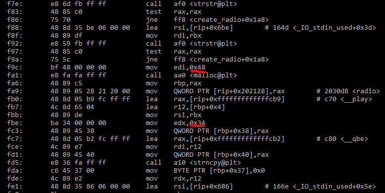
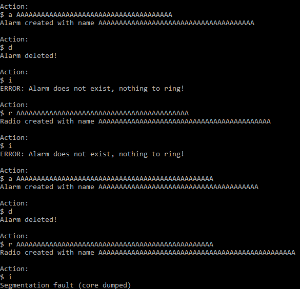

# Alarm (Binary Exploitation, 400 points)

We are given a binary and no source code this time! Let's try running it and testing some inputs, much like we did for [Review](../review-100/README.md).

\

Hmm...that "Alarm name: " looks rather suspicious at the bottom. As well, this program checks for format string attacks. Let's examine the objdump.

Right away, we identify `00000000000011b0 <what>:` as our probable flag function. Also, we find that this binary was **compiled with ASLR**. Our previous binaries, like Caesar, Review, etc. all had function addresses beginning with 0x0804 and a fixed code location. Now, this strange code location signifies that our code has **ASLR, PIE, or both, randomizing libc locations and/or code locations**. We'll set that aside for now.  Let's look at something we can control, like create_alarm().

We notice a whole bunch of strstr() at the beginning; this must be what checks for strings like "%x" and ends the program prematurely. As well, **we notice a malloc() call** of size 0x40. After that, it appears that some...pointers? named __ring and __qbe are allocated, as well as an array of size 0x28, or 40. Something is strncpy()'d in (presumably the name), and then the method ends.

Let's compare this to create_radio().

Interesting! The name array is now 0x34, a whole 12 characters larger. As well, the malloc() call allocated 0x48 bytes of memory. Hmmmm...

Recall that malloc fastbin lists are split into lists of size 0x8. Assuming that an alarm and radio get placed into the same bin, we may be able to overwrite something with the longer name buffer. Since we saw the "Alarm name:" earlier, there is a high chance of a **use-after-free exploit**. Since \_\_qbe seems to stay unused, we may be able to overwrite \_\_ring . Let's test it out!

Success! Let's hop into GDB and figure out what's going on. Don't forget to run `set disable-randomization off` so GDB doesn't "helpfully" disable ASLR for you.