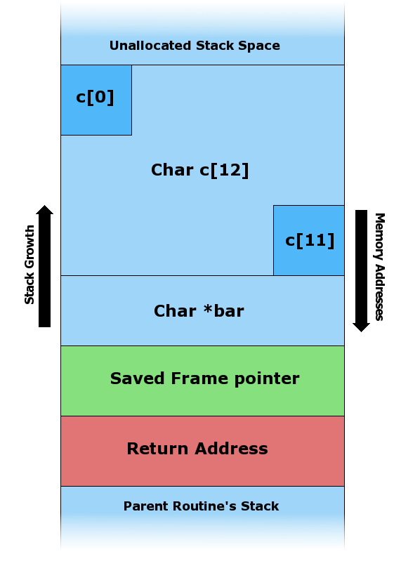
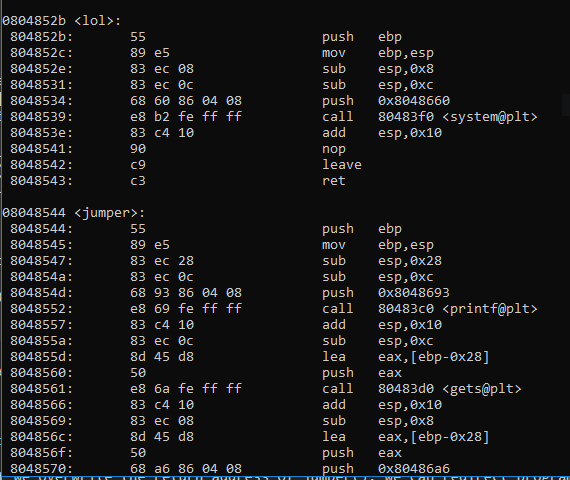

# Jumper (Binary Exploitation, 150 points)

### If you haven't read the writeup on [Review](../review-100/README.md), you should do so to get a quick primer on buffer overflows.

Armed with our new knowledge about buffer overflows, let's take a look at `jumper.c`. 

```
#include <stdlib.h>
#include <string.h>
#include <stdio.h>

void lol() {
	//get flag
	system("/bin/cat /home/ctfadmin/HSCTF-Problems/jumper/flag" /*|        | o */);
}						  										/*|        |/|\ look it's keith! */
						  										/*|        |/ \ great jumper, he is*/
						  										/*|        | */
void jumper() {	

	// can overflow!!	  										/*|        | */
	char dest[32];		  										/*|        | */
	printf("Gimme some input: ");								/*|        | */

	//dangerous!
	gets(dest);			  										/*|        | */
	printf("Jumping to %s\n", dest);							/*|        | */
}						  										/*|        | */
						  										/*|        | */
int main() {													/*|        | */
	setbuf(stdout, NULL);			  							/*|        | */
	gid_t gid = getegid();										/*|        | */
	setresgid(gid,gid,gid);										/*|        | */
	jumper();			  										/*|        | */
}						  										/*|        | */
```
Indeed, we spy another gets() call. However, this time there doesn't seem to be anything to overwrite after `dest`, so what do we do from here?

Let's go back to the Wikipedia diagrams. What's located below our character arrays?



Cool! Maybe if we overwrite the return address of jumper(), we can redirect program flow as long as there aren't any checks done. So now, our theoretical payload looks like `'AAAAA....' (garbage input) + '\x05\x05\x05\x05' (address we want to jump to)`. 

#### A note must be made here: most architectures store addresses in *little endian*: that is, the address `0xA1B2C3D4` is stored as `\xD4\xC3\xB2\xA1` in memory. More research is left as an exercise to the reader.

However, how are we going to find the address of lol() so that we can jump to it? Here begins the use of Linux utilities **objdump** and **gdb**. At its core, `objdump` provides a raw disassembly of an ELF binary, and `gdb` allows you to debug a program by stepping through instructions. 

Let's begin by running `objdump -d jumper -M intel`. This will (-d)isassemble jumper using Intel syntax.



By scrolling up a bit, we find the addresses of both lol() and jumper(). We can see that lol() starts at address `0x0804852b`, so let's modify our payload. It now looks like `'AAAA....' + '\x2b\x85\x04\x08' (little endian!)`.

Let's try running this through GDB. To run input, we're going to input the command `r <<< $(python -c "print 'A'*48")`. This means we are running the program and printing 32 "A"s into the program. Our goal is to control the return address, and by testing different amounts of "A"s we can eventually overwrite the return address and jump to somewhere else, giving us EIP (instruction pointer) control. I have chosen 48 because it's very likely that we have overflowed everything past the buffer, including the frame pointer and (hopefully) the return address.


Great! We've overflowed the return address and wrote 0x41 ("A") to the return address. Let's try a smaller number of As, maybe 42?


Not quite. We can see that the segfault address appears normal with no 0x41s anywhere, so we must have overwritten the frame pointer only. Let's try 46 As.


We're almost there! We can see a few As and the null byte C-string terminator appearing in our input. We have two extra As, so let's change our payload to 44 As and append the address `\x2b\x85\x04\x08` at the end. If all goes well, the 44 As should overwrite all other data, and the return address should be overwritten with the address of lol().


Success!! We don't have a "flag" file created, but our program clearly called lol(). Let's try it through netcat by *piping* our input into nc.


#### Our flag is `flag{keith_has_no_hops}`.

-----

## Why does this work?

We've performed the same exploit as [Review](../review-100/README.md), but instead of blindly overwriting a variable above our buffer, we now carefully craft and modify our payload to overwrite the *return address* of a method with a specially crafted input. This writeup also provides a primer on using objdump / gdb to create and test exploits locally.
